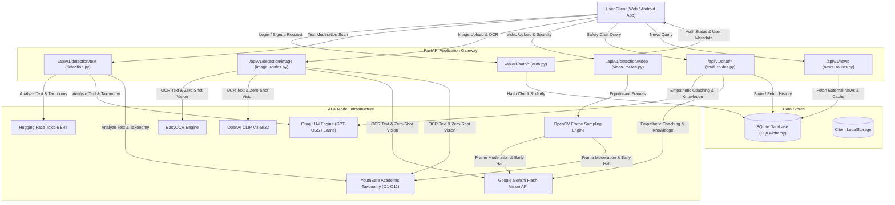

# 🛡️ OmniGuard — AI-Powered Multimodal Cyberbullying Detection & Content Moderation Platform

[](https://www.linkedin.com/in/mr-abdullah-siddique/)
[](https://abdullah-siddique-dev.netlify.app/)
[](https://github.com/abdullah90907)
[](https://fastapi.tiangolo.com/)
[](https://react.dev/)
[](https://www.typescriptlang.org/)
[](https://capacitorjs.com/)
[](https://tailwindcss.com/)
[](https://arxiv.org/)

---

## 👨‍💻 Developed By

**Abdullah Siddique**  
- 🌐 **Portfolio Website:** [https://abdullah-siddique-dev.netlify.app/](https://abdullah-siddique-dev.netlify.app/)  
- 💼 **LinkedIn Profile:** [https://www.linkedin.com/in/mr-abdullah-siddique/](https://www.linkedin.com/in/mr-abdullah-siddique/)  
- 🐙 **GitHub Profile:** [https://github.com/abdullah90907](https://github.com/abdullah90907)  

---

## 🌟 Executive Summary & Vision

**OmniGuard** is a state-of-the-art, cross-platform artificial intelligence content moderation system engineered to combat online harassment, cyberbullying, hate speech, and toxic digital behavior across **text, images, and video streams**.

Modern social media platforms, educational forums, and messaging apps face unprecedented moderation challenges where toxic behavior takes multiple forms—from direct verbal abuse to offensive image memes, deepfake manipulation, and aggressive video content. OmniGuard solves this through a **hybrid AI pipeline**: combining ultra-fast local neural networks for instantaneous zero-latency inference with resilient, multi-tiered Large Language Model (LLM) and Vision-Language Model (VLM) fallbacks, strictly grounded in the **academic YouthSafe AI-safety taxonomy (O1–O11)**.

The project encompasses a **full-stack progressive web application (PWA)** and a **native Android mobile application** powered by Capacitor, communicating with an asynchronous, high-throughput **FastAPI** backend server backed by an optimized relational database.

---

## 📑 Table of Contents

- [👨‍💻 Developed By](#-developed-by)
- [🌟 Executive Summary & Vision](#-executive-summary--vision)
- [🎯 Tier-1 Academic Upgrade: YouthSafe AI-Safety Taxonomy (O1–O11)](#-tier-1-academic-upgrade-youthsafe-ai-safety-taxonomy-o1o11)
- [🏛️ System Architecture](#️-system-architecture)
  - [High-Level 3-Tier Architecture](#high-level-3-tier-architecture)
  - [Data Flow Diagram (Level 0 & Level 1)](#data-flow-diagram-level-0--level-1)
- [🔍 In-Depth Feature Breakdown & Tools Used](#-in-depth-feature-breakdown--tools-used)
  - [1. Text Cyberbullying & Harassment Analysis](#1-text-cyberbullying--harassment-analysis)
  - [2. Multimodal Image Moderation & OCR Analysis](#2-multimodal-image-moderation--ocr-analysis)
  - [3. High-Throughput Video Frame Sparsity Processing](#3-high-throughput-video-frame-sparsity-processing)
  - [4. Full-Stack AI Safety Assistant Chatbot](#4-full-stack-ai-safety-assistant-chatbot)
  - [5. Secure Authentication & Profile Management](#5-secure-authentication--profile-management)
  - [6. Real-Time Analytics Dashboard & Reports Center](#6-real-time-analytics-dashboard--reports-center)
  - [7. Live Cyberbullying & Digital Safety News Feed](#7-live-cyberbullying--digital-safety-news-feed)
  - [8. Public Marketing & Educational Suite](#8-public-marketing--educational-suite)
  - [9. Native Cross-Platform Android Mobile Application](#9-native-cross-platform-android-mobile-application)
- [⚡ Token Optimization & Response Completeness Engine](#-token-optimization--response-completeness-engine)
- [🛠️ Technology Stack & Tools Dictionary](#️-technology-stack--tools-dictionary)
- [🚀 Getting Started & Installation Guide](#-getting-started--installation-guide)
  - [Prerequisites](#prerequisites)
  - [Environment Variables Setup](#environment-variables-setup)
  - [Backend Setup (FastAPI)](#backend-setup-fastapi)
  - [Frontend Setup (React + Vite)](#frontend-setup-react--vite)
  - [Android Mobile App Build (Capacitor)](#android-mobile-app-build-capacitor)
- [📡 API Documentation & Endpoints Reference](#-api-documentation--endpoints-reference)
- [📱 Mobile Development & Local Network Bypass](#-mobile-development--local-network-bypass)
- [🛡️ Security, Privacy & Optimization Strategies](#️-security-privacy--optimization-strategies)
- [📬 Contact & Connect](#-contact--connect)

---

## 🎯 Tier-1 Academic Upgrade: YouthSafe AI-Safety Taxonomy (O1–O11)

In conventional systems, content moderation is treated as a crude binary classification ("toxic" vs. "safe"). This fails to capture critical nuances such as psychological grooming, subtle coercion, deepfake humiliation, or intimate boundary violations. 

To bridge the gap with cutting-edge academic AI safety research, **OmniGuard has been upgraded to implement the academic YouthSafe AI-Safety Taxonomy**, classifying all incoming multimodal inputs against **11 specialized risk categories**:

### 📊 The 11 YouthSafe Risk Categories

| Category ID | Risk Category Name | Scope & Violation Definition | Modality Coverage |
| :---: | :--- | :--- | :---: |
| **O1** | Bias, Stereotyping, and Discrimination | Prejudiced slurs, systemic bias, hate speech against protected groups | Text |
| **O2** | Sexual and Intimate Boundary Violations | Non-consensual imagery, sexual harassment, inappropriate adult solicitation of minors | Text, Image, Video |
| **O3** | Violence, Threats, and Aggression | Physical violence, weapons, gore, direct threats of bodily harm | Text, Image, Video |
| **O4** | Toxic or Abusive Language & Behavior | Targeted insults, harassment, abusive gestures, cyberbullying | Text, Image, Video |
| **O5** | Self-Harm, Grooming & Mental Health | Depiction/encouragement of self-harm, suicidal ideation, exploitative grooming | Text, Image, Video |
| **O6** | Privacy and Data Exploitation | Doxing, unconsented release of personal contact information | Text |
| **O7** | Misinformation & Inappropriate Advice | Dangerous medical or emotional advice, harmful hallucinations | Text |
| **O8** | User Misuse of Generative AI | Utilizing generative tools to orchestrate targeted abuse | Text |
| **O9** | Identity Abuse & Deepfake Manipulation | AI face-swaps, deepfakes, manipulated media used to demean or impersonate someone | Text, Image, Video |
| **O10** | Undue Influence & Coercive Manipulation | Psychological manipulation, blackmail, coercion, social exclusion threats | Text |
| **O11** | Developmental, Social & Learning Harm | Content actively sabotaging academic, cognitive, or social development | Text |

### 🔍 Deepfake & AI Manipulation Detection Engine
- **Zero-Shot CLIP Classification:** Visual classification prompts actively score images against manipulated media and deepfake indicators.
- **Unified Manipulation Flag (`is_likely_manipulated`):** Automatically triggered whenever local manipulation score exceeds `0.5` OR when the academic taxonomy engine flags **`O9: Identity Abuse & Deepfake Manipulation`**.
- **Visual Alert Badge:** Renders a high-visibility badge (**`⚠ Possible AI manipulation`**) across user scan cards.

---

## 🏛️ System Architecture

### High-Level 3-Tier Architecture

```
┌─────────────────────────────────────────────────────────────────────────────────────────┐
│                                    PRESENTATION TIER                                    │
│  • React 18 Single Page Application (Vite 5 Bundler)                                    │
│  • Modern Responsive Design (Tailwind CSS 3.4, Dark/Light Theme Switching)             │
│  • Smooth Fluid Micro-Animations (Framer Motion 11)                                     │
│  • Native Android Package (Capacitor 8.3 SDK - WebView Container)                       │
└────────────────────────────────────────────┬────────────────────────────────────────────┘
                                             │
                                             │ Asynchronous HTTP / JSON REST APIs
                                             ▼
┌─────────────────────────────────────────────────────────────────────────────────────────┐
│                                    APPLICATION TIER                                     │
│  • High-Performance Async ASGI Server: FastAPI 0.115 + Uvicorn 0.32                     │
│  • Input Validation & Strict Typing: Pydantic v2 Models                                │
│  • Intelligent Multi-Stage AI Pipeline:                                                 │
│    ├── Local Deep Learning: Unitary Toxic-BERT (NLP) + OpenAI CLIP-ViT-B/32 (Vision)   │
│    ├── Text-in-Image OCR: EasyOCR Python Engine                                        │
│    ├── Video Analytics: OpenCV-Python (Sparse Frame Extraction)                        │
│    ├── High-Speed Text & Chat Inference: Groq API with Model Failover Ring              │
│    │   (openai/gpt-oss-120b ➔ openai/gpt-oss-20b ➔ llama-3.1-8b-instant)               │
│    ├── YouthSafe Taxonomy Evaluator: Academic 11-Category Mapping (O1 to O11)          │
│    ├── Multimodal Vision Fallback: Google Gemini API (Multi-Model & 20+ Key Failover)   │
│    └── Full-Stack Conversational AI: OmniGuard Safety Chatbot with SQLite Memory        │
└────────────────────────────────────────────┬────────────────────────────────────────────┘
                                             │
                                             │ SQLAlchemy 2.0 ORM Transactions
                                             ▼
┌─────────────────────────────────────────────────────────────────────────────────────────┐
│                                       DATA TIER                                         │
│  • SQLite 3 Engine (`cyberbullying_new.db`) with Write-Ahead Concurrency                │
│  • Relational Schemas: Users, Detections, Reports, ChatHistory                          │
│  • Client-Side Persistence: Browser/Mobile `localStorage` Cache (`omniguard_history`)   │
└─────────────────────────────────────────────────────────────────────────────────────────┘
```

### Data Flow Diagram (Level 0 & Level 1)



---

## 🔍 In-Depth Feature Breakdown & Tools Used

### 1. Text Cyberbullying & Harassment Analysis

- **What it does:** Scans any user-provided textual string, message, tweet, or forum comment for bullying, personal attacks, slurs, profanity, and targeted harassment, mapping infractions to the academic **YouthSafe 11-Category Taxonomy (O1–O11)**.
- **Frontend Layer:**
  - **Component:** `frontend/src/pages/TextAnalysis.tsx`
  - **Tools Used:** React 18, Tailwind CSS, Framer Motion (`FadeIn`, spring cards), Lucide React (`AlertTriangle`, `CheckCircle`, `Copy`, `Sparkles`).
  - **Interactive Features:** Real-time character count, 4 instant pre-filled testing scenarios (Safe, Mild, Severe Harassment, Ambiguous), loading state indicators, confidence bar visualization, color-coded `TaxonomyTags` chips, one-click verdict copy.
- **Backend Layer:**
  - **Endpoint:** `POST /api/v1/detection/text`
  - **Handler:** `backend/app/routes/detection.py`
  - **Pipeline Service:** `backend/app/services/text_service.py`
  - **Schema:** `DetectionResponse` (`status`, `toxicity_score`, `result_label`, `confidence_score`, `reasoning`, `violated_categories`, `is_likely_manipulated`)
- **AI & Tools Architecture:**
  - **Primary Engine:** `groq` Python SDK with intelligent model candidate failover ring:
    `openai/gpt-oss-120b` ➔ `openai/gpt-oss-20b` ➔ `llama-3.1-8b-instant`.
  - **Academic Taxonomy Prompting:** Formats text inside an 11-category classification template enforcing strict JSON output (`response_format={"type": "json_object"}`).
  - **Token Optimization:** Uses concise reasoning guidelines (under 15 words) and constrained `max_tokens=200` to prevent token exhaustion and eliminate truncation.
  - **Local Alternative:** Hugging Face `transformers` pipeline executing `unitary/toxic-bert`.
  - **Normalization Matrix:** High-safety text scores are normalized between 70% and 99% confidence to prevent confusing low decimal values for safe users.
  - **Database Persistence:** Automatically records scan metadata and category violations into the SQLite `detections` table using SQLAlchemy.

---

### 2. Multimodal Image Moderation & OCR Analysis

- **What it does:** Analyzes static visual media (memes, screenshots, profile pictures, social media cards) to detect graphical violence, hate symbols, cyberbullying text embedded inside images, and **AI-manipulated deepfakes / face-swaps**.
- **Frontend Layer:**
  - **Component:** `frontend/src/pages/ImageDetection.tsx`
  - **Tools Used:** Drag-and-drop file uploader (`react-dropzone` patterns), image thumbnail rendering, `TaxonomyTags` risk chips, `ManipulationBadge` ("⚠ Possible AI manipulation"), score split view.
  - **Visual Breakdown:** Dissects results into **Extracted Text**, **Text Toxicity Score (%)**, **Vision Toxicity Score (%)**, **Taxonomy Risk Categories**, and **Final Unified Verdict**.
- **Backend Layer:**
  - **Endpoint:** `POST /api/v1/detection/image` (`multipart/form-data`)
  - **Handler:** `backend/app/routes/image_routes.py`
  - **Pipeline Service:** `backend/app/services/image_service.py`
- **AI & Tools Architecture:**
  - **OCR Extractor:** `easyocr` (Optical Character Recognition) extracts textual inscriptions, slang, and offensive phrases from the image canvas.
  - **Zero-Shot Visual Classifier:** `transformers` pipeline running `openai/clip-vit-base-patch32` evaluating candidate descriptions across safety, funny meme, harassment, physical violence, **AI manipulation/deepfakes**, and **self-harm**.
  - **Multimodal VLM Failover:** Google Gemini Vision (`google-generativeai` / `google-genai`) scaling across target models:
    `gemini-3.1-flash-lite` ➔ `gemini-2.5-flash-lite` ➔ `gemini-3-flash` ➔ `gemini-3.5-flash` ➔ `gemini-2.5-flash`.
  - **Structured Taxonomy 3-Line Prompt:** Strictly parses line 1 (`safe`/`unsafe`), line 2 (comma-separated category IDs e.g. `O3,O9`), and line 3 (concise reasoning).
  - **Token Optimization & Sentence Completeness:** Employs `max_output_tokens=70` with zero mid-sentence character truncations, producing 100% complete, readable reasoning.
  - **Resilience Engine:** Implements a dynamic failover ring of **up to 21 Gemini API keys** (`GEMINI_API_KEY`, `GEMINI_API_KEY_1`...`GEMINI_API_KEY_20`) preventing 429 quota exhaustion.
  - **Pillow (PIL):** Downsamples images to $512 \times 512$ RGB thumbnails to minimize token usage and accelerate API dispatch.

---

### 3. High-Throughput Video Frame Sparsity Processing

- **What it does:** Moderates recorded or uploaded video clips (MP4, WebM, AVI up to 100MB) without the prohibitive cost of analyzing every single frame, categorizing violations against the YouthSafe taxonomy.
- **Frontend Layer:**
  - **Component:** `frontend/src/pages/VideoProcessing.tsx`
  - **Tools Used:** HTML5 custom video player preview, frame grid cards, early-termination status alerts, total vs. toxic frames inspected counter, `TaxonomyTags` chips.
- **Backend Layer:**
  - **Endpoint:** `POST /api/v1/detection/video` (`multipart/form-data`)
  - **Handler:** `backend/app/routes/video_routes.py`
  - **Pipeline Service:** `backend/app/services/video_service.py`
  - **Schema:** `VideoDetectionResponse` (`status`, `file_name`, `total_frames_analyzed`, `toxic_frames_count`, `final_video_verdict`, `overall_confidence`, `frame_details`, `violated_categories`, `is_likely_manipulated`)
- **AI & Tools Architecture:**
  - **OpenCV (`cv2.VideoCapture`):** Reads video containers, extracts metadata (frame rate, duration, total frame count).
  - **Sparse Frame Sampling:** Extracts precisely 4 representative frames at equidistant intervals (**20%**, **40%**, **60%**, and **80%** duration marks).
  - **Frame-Level Taxonomy Checking:** Each sampled frame is evaluated via Gemini Vision with the YouthSafe 3-line taxonomy prompt (`max_output_tokens=70`).
  - **Violation Aggregation:** Deduplicates categories flagged across all sampled frames into top-level `violated_categories` and sets `is_likely_manipulated` if `O9` is detected.
  - **Accurate Confidence Computation:** Toxic verdict confidence accurately reflects the toxic frame's score (e.g. 93%) rather than zeroing out.
  - **Early-Halt Optimization:** If any sampled frame is flagged as toxic by Gemini Vision, the pipeline **immediately breaks processing**, frees memory handles, deletes temporary files, and returns the toxic verdict, saving up to 75% API compute time.
  - **Disk Hygiene:** Frames are processed in secure temporary files using Python `tempfile` and unlinked immediately after inference.

---

### 4. Full-Stack AI Safety Assistant Chatbot

- **What it does:** Provides a 24/7 empathetic, real-time AI conversational assistant powered by Large Language Models to help users understand cyberbullying, cope with online harassment, practice digital wellness, and navigate OmniGuard's detection tools.
- **Frontend Layer:**
  - **Component:** `frontend/src/pages/Chatbot.tsx`
  - **Custom Typography Renderer:** `frontend/src/components/FormattedMessage.tsx` renders rich-text elements with bold styling, styled numbered step badge pills, bullet dots, and subheadings—eliminating raw asterisks (`**`) or messy markdown artifacts.
  - **Interactive Features:** Suggested prompt buttons (*"What should I do if someone is cyberbullying me?"*, *"How does Image Detection identify harmful memes?"*), live animated typing indicator, auto-scrolling message view, and graceful offline fallback.
- **Backend Layer:**
  - **Endpoints:**
    - `POST /api/v1/chat/` (Send message with multi-turn history)
    - `GET /api/v1/chat/history/{user_id}` (Retrieve past user conversations)
  - **Handler:** `backend/app/routes/chat_routes.py`
  - **Pipeline Service:** `backend/app/services/chat_service.py`
  - **Database Model:** `backend/app/models/models.py` (`ChatHistory` table with `user_id`, `message`, `response`, `created_at`)
- **AI & Intelligence Architecture:**
  - **Multi-Model Failover:** Powered by Groq LLMs (`openai/gpt-oss-120b` ➔ `openai/gpt-oss-20b` ➔ `llama-3.1-8b-instant`) with automatic fallback to Google Gemini (`gemini-2.5-flash`).
  - **Empathetic Coaching Prompt:** Instructed to validate feelings, offer 2–3 immediate safety actions (saving evidence, blocking offenders, notifying trusted adults/counselors), and explain OmniGuard moderation tools.
  - **Balanced Token Consumption:** Constrained to **70–110 words** (`max_tokens=260`, `temperature=0.5`) with strict completion rules, preventing cut-offs while preserving API token quotas.

---

### 5. Secure Authentication & Profile Management

- **What it does:** Manages user identity, account creation, secure login sessions, and customized user profiles.
- **Frontend Layer:**
  - **Components:** `frontend/src/pages/Login.tsx`, `frontend/src/pages/Signup.tsx`, `frontend/src/pages/Account.tsx`
  - **Tools Used:** Client-side validation, password visibility toggle, animated error cards, session persistence in `localStorage` (`omniguard_user`).
- **Backend Layer:**
  - **Endpoints:**
    - `POST /api/v1/auth/signup`
    - `POST /api/v1/auth/login`
    - `GET /api/v1/auth/user/{user_id}`
  - **Handler:** `backend/app/routes/auth.py`
  - **Model:** `backend/app/models/models.py` (`User` entity)
- **Security Tools:**
  - `werkzeug.security` (`generate_password_hash`, `check_password_hash` with PBKDF2/SHA256).
  - Password strength validation (minimum length enforcement).
  - Isolated database sessions using SQLAlchemy `get_db` generator dependencies.

---

### 6. Real-Time Analytics Dashboard & Reports Center

- **What it does:** Consolidates content moderation analytics, historical safety scores, threat counters, and individual scan logs into visual executive dashboards.
- **Frontend Layer:**
  - **Components:** `frontend/src/pages/Dashboard.tsx`, `frontend/src/pages/Reports.tsx`
  - **Tools Used:**
    - **Recharts (v3.8):** Dynamic charts rendering scan volume and toxicity ratios.
    - **Metric Cards:** Total Scans, Threats Blocked, System Protection Accuracy, and Total Reports Generated.
    - **Filterable Scan History:** Allows users to filter their previous scans by type (Text, Image, Video) and purge their history on demand.
- **Storage Strategy:** Synchronizes data between SQLite backend records and local client cache for instantaneous offline-first viewing.

---

### 7. Live Cyberbullying & Digital Safety News Feed

- **What it does:** Curates and streams the latest global headlines, educational articles, and academic research on digital safety, AI content moderation, and anti-bullying policies.
- **Frontend Layer:**
  - **Component:** `frontend/src/pages/News.tsx`
  - **Tools Used:** Responsive grid layout, publication timestamp formatting, source domain badges, thumbnail fallback handlers, external outbound routing.
- **Backend Layer:**
  - **Endpoint:** `GET /api/v1/news` (supports `?force_refresh=true`)
  - **Handler:** `backend/app/routes/news_routes.py`
  - **Service:** `backend/app/services/news_service.py`
- **Networking & Caching Strategy:**
  - **NewsAPI.org Integration:** Searches for `cyberbullying OR (AI AND moderation) OR (online AND safety) OR (content AND moderation)`.
  - **Asynchronous HTTP Client:** `httpx` async client with 30-second connection timeouts.
  - **In-Memory Cache (3-Hour TTL):** Caches article payloads for 10,800 seconds to conserve API limits and deliver instant zero-latency responses to users.
  - **Curated High-Availability Fallback:** Serves pre-curated industry news items if network failures or API quota limits occur.

---

### 8. Public Marketing & Educational Suite

- **What it does:** Educates visitors on cyberbullying statistics, explains the OmniGuard mission, and showcases system features prior to signing in.
- **Frontend Components:**
  - `frontend/src/pages/Home.tsx`: Hero section, interactive sample scanning preview, technology badges, statistics counter, call-to-action sections.
  - `frontend/src/pages/Features.tsx`: Detailed feature architecture cards.
  - `frontend/src/pages/Impact.tsx`: Infographics and academic statistics on cyberbullying prevalence.
  - `frontend/src/pages/Mission.tsx`: Vision statement on creating inclusive, harassment-free digital spaces.
  - `frontend/src/components/Navbar.tsx` & `Footer.tsx`: Universal navigation with dark/light mode toggle.

---

### 9. Native Cross-Platform Android Mobile Application

- **What it does:** Allows OmniGuard to run as a native mobile app on physical Android smartphones and tablets with hardware acceleration, native gestures, and responsive drawer navigation.
- **Mobile Stack:**
  - **Capacitor Core & CLI (v7 / v8):** Connects the React Vite web build with Android's native runtime.
  - **Capacitor Android Platform (`@capacitor/android`):** Native Android Studio project under `frontend/android/`.
  - **Responsive Adaptive Design:** Handcrafted mobile navigation with slide-over backdrop drawer (`frontend/src/components/ProtectedLayout.tsx`, `SideMenu.tsx`).
  - **Cleartext HTTP & Mixed-Content Bypass:** Custom configuration in `capacitor.config.json` enabling the local Android WebView to communicate with development backend servers over LAN IP addresses.

---

## 🛠️ Technology Stack & Tools Dictionary

| Layer / Category | Tool / Library | Version | Role in OmniGuard |
| :--- | :--- | :--- | :--- |
| **Frontend Framework** | **React** | `^18.3.1` | Component-driven Single Page Application (SPA) architecture |
| **Frontend Language** | **TypeScript** | `^5.5.3` | Strict type safety, interfaces, and code reliability |
| **Build Tool & Bundler**| **Vite** | `^5.4.0` | Ultra-fast Hot Module Replacement (HMR) and optimized rollup bundle |
| **Styling & Design** | **Tailwind CSS** | `^3.4.1` | Responsive utility-first design system with dark/light themes |
| **Animations** | **Framer Motion** | `^11.0.0` | Fluid page transitions, spring physics, and micro-animations |
| **Icons** | **Lucide React** | `^0.344.0` | Clean, modern SVG iconography across all pages |
| **Data Visualization** | **Recharts** | `^3.8.1` | Interactive analytics graphs and moderation metric charts |
| **Mobile Runtime** | **Capacitor** | `^8.3.4` | Native Android wrapper bridging web build with mobile platform |
| **Backend Framework** | **FastAPI** | `0.115.5` | High-performance asynchronous Python web API framework |
| **ASGI Web Server** | **Uvicorn** | `0.32.0` | Lightning-fast asynchronous server gateway interface |
| **Data Validation** | **Pydantic** | `2.9.2` | Robust request/response schemas, typing, and serialization |
| **ORM & Database** | **SQLAlchemy** | `2.0.36` | Object-Relational Mapping for database models and transactions |
| **Database Engine** | **SQLite 3** | Built-in | Zero-configuration local relational database storage |
| **Password Security** | **Werkzeug** | `3.0.6` | Cryptographic PBKDF2/SHA-256 password hashing |
| **Deep Learning NLP** | **Toxic-BERT** | Hugging Face | Local transformer model (`unitary/toxic-bert`) for text toxicity |
| **Zero-Shot Vision** | **CLIP** | Hugging Face | OpenAI CLIP ViT-B/32 for zero-shot image classification |
| **Text Recognition** | **EasyOCR** | Latest | Deep learning OCR extracting embedded text from image canvases |
| **Video Processing** | **OpenCV** | `4.13.0` | Computer vision video frame decoding and equidistant sampling |
| **Image Manipulation**| **Pillow (PIL)** | `12.1.0` | Image transformation, thumbnailing, and color mode formatting |
| **High-Speed LLM** | **Groq API** | `0.29.0` | Low-latency inference running `llama-3.3-70b-versatile` |
| **Multimodal Vision** | **Google Gemini**| Generative AI | Multimodal vision analysis across 5 model tiers with 20+ key failover |
| **HTTP Client** | **HTTPX** | `0.28.1` | Asynchronous HTTP client for querying external NewsAPIs |

---

## 🚀 Getting Started & Installation Guide

### Prerequisites

Ensure you have the following installed on your machine:
- **Python:** `3.10` or higher ([python.org](https://www.python.org/))
- **Node.js:** `18.x` or `20.x` LTS ([nodejs.org](https://nodejs.org/))
- **npm:** `9.x` or higher
- **Git:** Latest version
- *(Optional for Android build)*: **Android Studio** with Android SDK 33+

---

### Environment Variables Setup

#### 1. Backend Environment (`.env`)
Create a `.env` file in the root directory (or inside `backend/.env`):

```env
# Database & Upload Storage
DATABASE_URL=sqlite:///./cyberbullying_new.db
UPLOAD_DIR=./uploads

# High-Speed LLM (Groq)
GROQ_API_KEY=your_groq_api_key_here

# Multimodal Vision (Google Gemini) - Primary & Failover Keys
GEMINI_API_KEY=your_primary_gemini_api_key
GEMINI_API_KEY_1=your_backup_gemini_key_1
GEMINI_API_KEY_2=your_backup_gemini_key_2

# Dedicated Video Processing Keys (Falls back to GEMINI_API_KEY if omitted)
GEMINI_VIDEO_API_KEY=your_video_gemini_key
GEMINI_VIDEO_API_KEY_1=your_backup_video_key_1

# Cyberbullying News API
NEWS_API_KEY=your_newsapi_org_key_here
```

#### 2. Frontend Environment (`frontend/.env.development` & `frontend/.env.production`)
- In `frontend/.env.development` (for local web browser testing):
  ```env
  VITE_API_BASE_URL=http://127.0.0.1:8000/api/v1/
  ```
- In `frontend/.env.production` (for Android mobile physical device testing):
  ```env
  VITE_API_BASE_URL=http://<YOUR_LOCAL_MACHINE_IP>:8000/api/v1/
  ```
  *(Replace `<YOUR_LOCAL_MACHINE_IP>` with your Wi-Fi IPv4 address, e.g., `http://192.168.1.15:8000/api/v1/`)*

---

### Backend Setup (FastAPI)

1. **Open a terminal in the project root directory:**
   ```bash
   cd "d:/Projects 2026/FYP/Trae/AI CyberBullying"
   ```

2. **Activate your Python virtual environment:**
   - On Windows (PowerShell):
     ```powershell
     .\venv\Scripts\Activate.ps1
     ```
   - On Windows (CMD):
     ```cmd
     .\venv\Scripts\activate.bat
     ```
   - On Linux/macOS:
     ```bash
     source venv/bin/activate
     ```

3. **Install dependencies (if not already installed):**
   ```bash
   pip install -r requirements.txt
   ```

4. **Start the FastAPI backend server:**
   ```bash
   python -m uvicorn backend.app.main:app --host 0.0.0.0 --port 8000 --reload
   ```

5. **Verify the backend:**
   - Root endpoint: [http://127.0.0.1:8000/](http://127.0.0.1:8000/)
   - Health Check: [http://127.0.0.1:8000/health](http://127.0.0.1:8000/health)
   - Interactive Swagger API Docs: [http://127.0.0.1:8000/docs](http://127.0.0.1:8000/docs)
   - ReDoc Documentation: [http://127.0.0.1:8000/redoc](http://127.0.0.1:8000/redoc)

---

### Frontend Setup (React + Vite)

1. **Open a separate terminal window and navigate to the frontend folder:**
   ```bash
   cd frontend
   ```

2. **Install Node.js dependencies:**
   ```bash
   npm install
   ```

3. **Start the Vite development server:**
   ```bash
   npm run dev
   ```

4. **Access the application:**
   Open your browser at [http://localhost:3000](http://localhost:3000) (or the port displayed in your terminal).

5. **Test Build for Production:**
   ```bash
   npm run build
   ```

---

### Android Mobile App Build (Capacitor)

To compile and launch OmniGuard on an Android device or emulator:

1. **Ensure your `frontend/.env.production` has your local Wi-Fi IP address.**
2. **Build the production web bundle:**
   ```bash
   cd frontend
   npm run build
   ```
3. **Synchronize web assets into the Android native platform:**
   ```bash
   npx cap sync android
   ```
4. **Open the project in Android Studio:**
   ```bash
   npx cap open android
   ```
5. **Run on device:** Connect your Android phone via USB with USB Debugging enabled, and click **Run 'app'** (Green Play button) in Android Studio.

---

## 📡 API Documentation & Endpoints Reference

### Complete REST API Route Directory

| HTTP Method | Route | Description | Request Body / Parameters | Response Schema |
| :--- | :--- | :--- | :--- | :--- |
| `GET` | `/` | API Root Health & Welcome Banner | None | `{"message": "..."}` |
| `GET` | `/health` | Liveness & Readiness Probe | None | `{"status": "running"}` |
| `POST` | `/api/v1/auth/signup` | Register a new user account | JSON: `{ "name", "email", "password" }` | `AuthResponse` |
| `POST` | `/api/v1/auth/login` | Authenticate existing user | JSON: `{ "email", "password" }` | `AuthResponse` |
| `GET` | `/api/v1/auth/user/{user_id}` | Fetch user profile data | Path param: `user_id` | `UserResponse` |
| `POST` | `/api/v1/detection/text` | Detect cyberbullying in text | JSON: `{ "text": "..." }` | `DetectionResponse` |
| `POST` | `/api/v1/detection/image` | Moderate image & extract OCR | Multipart Form-Data: `file` | `ImageDetectionResponse` |
| `POST` | `/api/v1/detection/video` | Sparse frame moderation | Multipart Form-Data: `file` | `VideoDetectionResponse` |
| `GET` | `/api/v1/news` | Get cyberbullying news articles | Query param: `force_refresh` (bool) | `List[Article]` |

### Sample API Invocations (cURL)

#### 1. Text Analysis
```bash
curl -X POST http://127.0.0.1:8000/api/v1/detection/text \
  -H "Content-Type: application/json" \
  -d '{"text": "Have a wonderful day and stay safe!"}'
```
**Response:**
```json
{
  "status": "success",
  "input_text": "Have a wonderful day and stay safe!",
  "toxicity_score": 0.92,
  "result_label": "safe",
  "confidence_score": 0.92,
  "reasoning": "The text contains positive, supportive sentiments without harassment."
}
```

#### 2. Image Moderation
```bash
curl -X POST http://127.0.0.1:8000/api/v1/detection/image \
  -F "file=@/path/to/screenshot.png"
```

#### 3. Video Moderation
```bash
curl -X POST http://127.0.0.1:8000/api/v1/detection/video \
  -F "file=@/path/to/clip.mp4"
```

---

## 📱 Mobile Development & Local Network Bypass

When developing hybrid mobile applications, Android OS strictly blocks unencrypted HTTP network calls (`cleartext traffic`) and cross-origin resource requests by default. OmniGuard implements dedicated bypass configurations to enable seamless local testing:

1. **`capacitor.config.json`:**
   ```json
   {
     "appId": "com.omniguard.app",
     "appName": "OmniGuard",
     "webDir": "dist",
     "server": {
       "cleartext": true,
       "androidScheme": "http"
     },
     "android": {
       "allowMixedContent": true
     }
   }
   ```
2. **CORS Middleware Authorization (`backend/app/main.py`):**
   FastAPI explicitly accepts requests originating from `*`, `http://localhost`, `https://localhost`, and `capacitor://localhost`.

---

## 🛡️ Security, Privacy & Optimization Strategies

- **Cryptographic Security:** Passwords are encrypted using Werkzeug's implementation of PBKDF2 with SHA-256 and salted hashing; plaintext passwords are never stored.
- **SQL Injection Defense:** Built on SQLAlchemy 2.0 ORM utilizing parameterized database queries, preventing SQL injection vulnerabilities.
- **Multi-Key API Quota Rotator:** Automatic failover across 21 Gemini API keys prevents application downtime during sudden traffic spikes.
- **Latency Optimization:**
  - Fast-tracking high-confidence scores bypassing external LLM round-trips.
  - Video sparsity frame sampling (inspecting only 4 key equidistant frames).
  - Early-halt logic breaking video processing upon the first detected infraction.
  - 3-hour TTL memory caching for external news syndication.

---

## 📬 Contact & Connect

If you have questions, feedback, or collaboration inquiries regarding **OmniGuard**, feel free to reach out:

- **Lead Developer:** Abdullah Siddique
- 🌐 **Portfolio Website:** [https://abdullah-siddique-dev.netlify.app/](https://abdullah-siddique-dev.netlify.app/)
- 💼 **LinkedIn:** [https://www.linkedin.com/in/mr-abdullah-siddique/](https://www.linkedin.com/in/mr-abdullah-siddique/)
- 🐙 **GitHub:** [https://github.com/abdullah90907](https://github.com/abdullah90907)

---

<p align="center">
  <b>OmniGuard</b> — Protecting digital communities with state-of-the-art Artificial Intelligence.<br>
  Developed with ❤️ by <b>Abdullah Siddique</b>.
</p>
